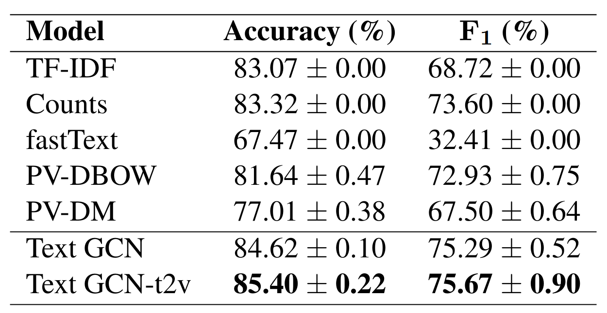

## Comparing traditional NLP techniques to Graph Convolutional Network for Swahili News Classification
This work empirically demonstrates the ability of Text Graph Convolutional Network (Text GCN) to outperform traditional natural language processing benchmarks for the task of semi-supervised Swahili news classification. In particular, we focus our experimentation on the sparsely-labelled semi-supervised context which is representative of the practical constraints facing low-resourced African languages. We follow up on this result by introducing a variant of the Text GCN model which utilises a bag of words embedding rather than a naive one-hot encoding to reduce the memory footprint of Text GCN whilst demonstrating similar predictive performance.

This repo contains the code used to generate the experimental results presented in:
> 
**TODO**

## Prerequisites
This project is compatible with Python >= 3.6.9. Install the full list of dependencies in your virtual environemnt by running:
```code
pip install -r requirements.txt
```

## Download the data
The raw dataset can be downloaded, preprocessed, and organised into a DataFrame by running the following command:
```code
python src/create_dataset.py <DOWNLOADED_DATA_DIR_NAME> --dataset-name <DATASET_NAME>
```
This script is set up to handle `Helsinki Corpus of Swahili 2.0 Not Annotated Version` and the Zenodo `Swahili : News Classification Dataset`. You select which dataset to process using the `--dataset-name` CLI option. The dataset split is generated by this script as well.

## Preprocessing
We can apply preprocessing (stemming, error removal, etc.) using the script below:
```code
python src/generate_stemming_map.py \
    --results-dir <PREPROC_DATA_DIR_NAME> \
    --input-data-dir  <DOWNLOADED_DATA_DIR_NAME>
```
This gives us our cleaned stemming map and vocabulary counts as the main outputs.

## Train baseline models
A number of baseline models are set up to be trained out-the-box. They all use a feature generation stage followed by a logistic regression classifier. Here's an excerpt from our paper with the baseline model alongside their accuracy and F1 score:



To train any of these models, simply use the following:
```code
python src/train_baseline.py <BASELINE_RESULTS_DIR> \
    --input-data-dir <DOWNLOADED_DATA_DIR_NAME> \
    --stemmer-path <PREPROC_DATA_DIR_NAME>/stemming/stemming_cleaned.json \
    --model <BASELINE_MODEL>
```

## Train Text GCN models
There are two Text GCN variant models which can be trained: the vanilla `Text GCN` and `Text GCN-t2v`. You can refer to the figure below for a comparison of these models to selected baseline models as the proportion of training labels is varied.

**TODO**

To train a GCN model, run:
```code
python src/train_gnn.py <GNN_RESULTS_DIR> \
    --input-data-dir <DOWNLOADED_DATA_DIR_NAME> \
    --stemmer-path <PREPROC_DATA_DIR_NAME>/stemming/stemming_cleaned.json \
    --model <GNN_MODEL> \
    --input-features <NODE_REREPRESENTATION> \
    ....
```
As with all the above scripts, you can use the `--help` flag to see the full set of CLI options.

## Cite our work

**TODO**

## Cite the datasets

Zenodo's Swahili News Dataset:
```
@misc{davis_david_2020_4300294,
  author       = {Davis David},
  title        = {Swahili : News Classification Dataset},
  month        = dec,
  year         = 2020,
  publisher    = {Zenodo},
  version      = {0.1},
  doi          = {10.5281/zenodo.4300294},
  url          = {https://doi.org/10.5281/zenodo.4300294}
}
```

Helsinki Corpus of Swahili 2.0:
```
@misc{hcs-na-v2_en,
 author={Arvi Hurskainen and {Department of World Cultures, University of Helsinki}},
 year={2016},
 title={{Helsinki Corpus of Swahili 2.0 Not Annotated Version}},
 publisher={Kielipankki},
 type={text corpus},
 url={http://urn.fi/urn:nbn:fi:lb-2016011302},
}
```
